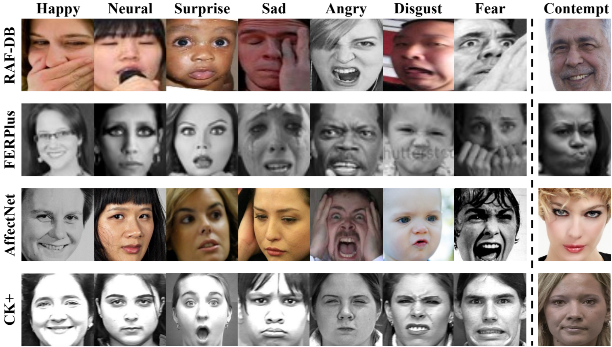
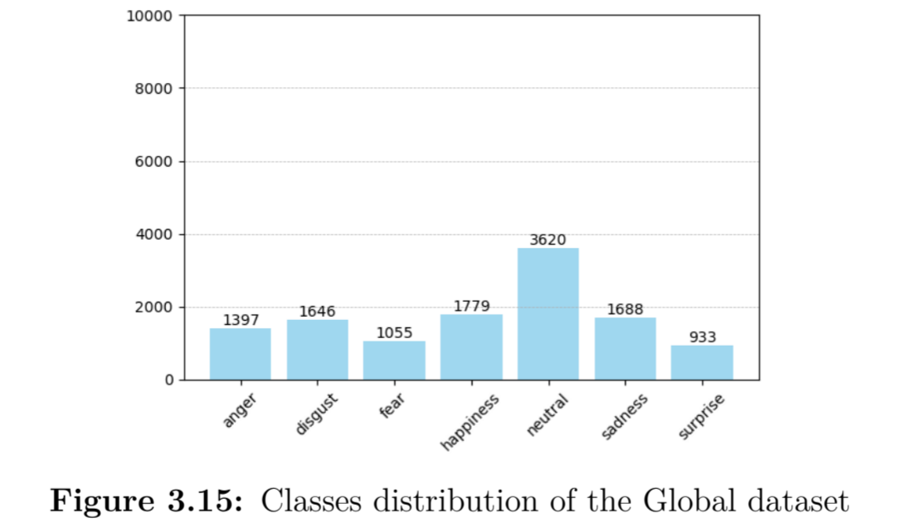
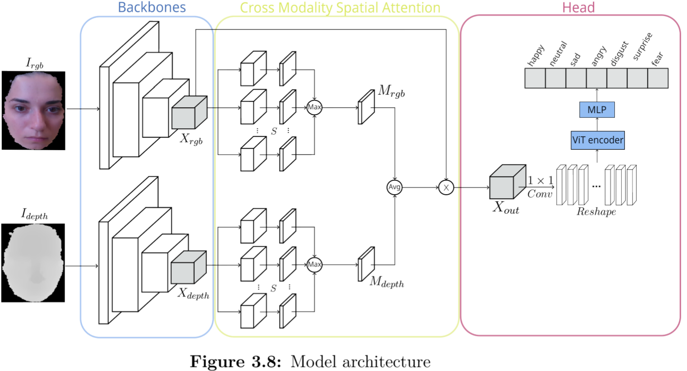
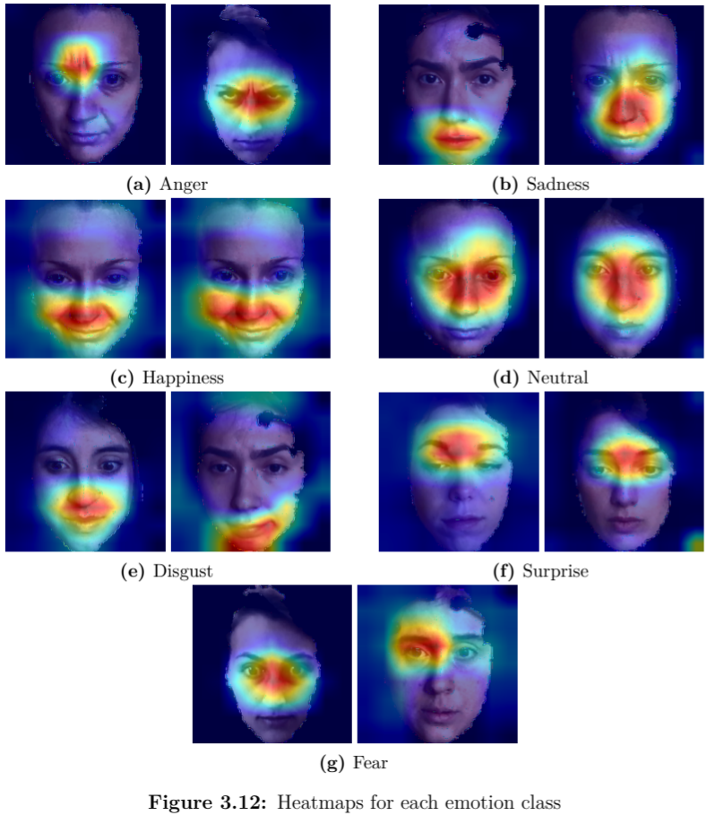
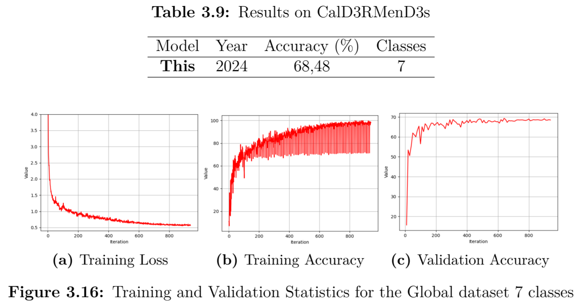

# Full Tractation PDF

[Full Tractation](./Images/ReadME/Full_document.pdf)

# FER
Facial Emotion Recognition (FER) is a complex and crucial task in computer vision with widespread applications in fields such as human-computer interaction, psychology, healthcare, and marketing. Its goal is to accurately identify a person’s emotional state based on their facial expressions. However, the inherent variability of facial expressions across individuals, cultures, and contexts presents significant challenges. Recent advancements in deep learning, particularly in Convolutional Neural Networks (CNNs), have greatly enhanced the performance of FER systems, enabling near-human accuracy, especially in cases where emotions are clearly expressed.

  

# Contribution

This work’s contribution can be summarised into:

* Review of the current state of the art in FER, with a focus on the most common datasets and the challenges faced by FER models.
* A proposal of a deep architecture that is able to deal with multimodal data representation (RGBD) and to learn from the unbalanced dataset. The architecture is based on the state of the art in FER and is designed to be robust to the challenges faced by FER models.
* Loss Function analysis and evaluation of the model’s performance on the CalD3rMenD3S dataset in different conditions.
* Merge of the CalD3rMenD3S, BU3DFE and Bosphorus datasets to create a larger and more diverse dataset and final evaluation of the model’s performance on this new dataset.

# Dataset
CalD3rMenD3s, BU3DFE and Bosphorus datasets are merged into a single dataset and the model is trained on it. The dataset distribution is shown in the following figure:

  

# Model
Full model architecture and GRADCAM heatmaps showing regions where network is focusing on for each class:

  

  

# Results
Accuracy of the model on the global dataset, confusion matrix, and extracted features using Island Loss function:

  

  

# Requirements
Use timm version 0.9.7 for pretrained model import.
